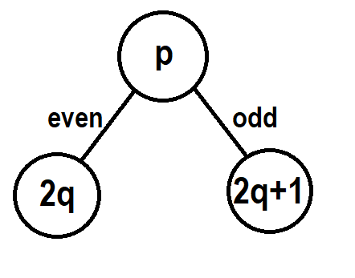
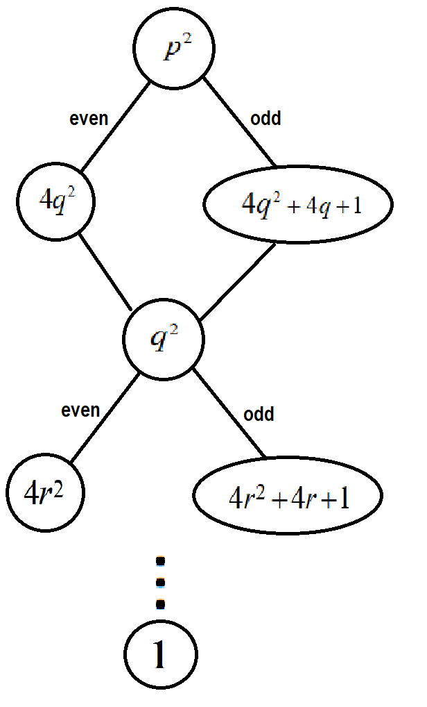
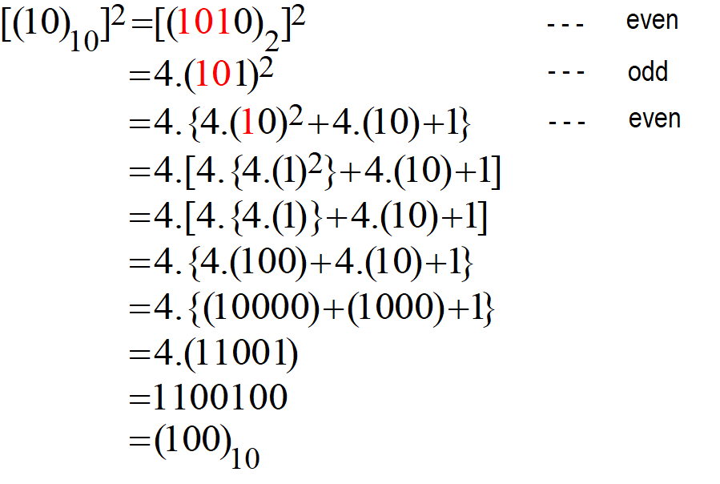
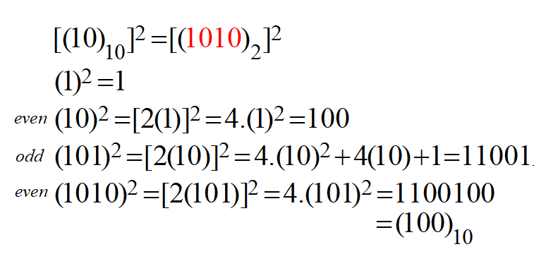
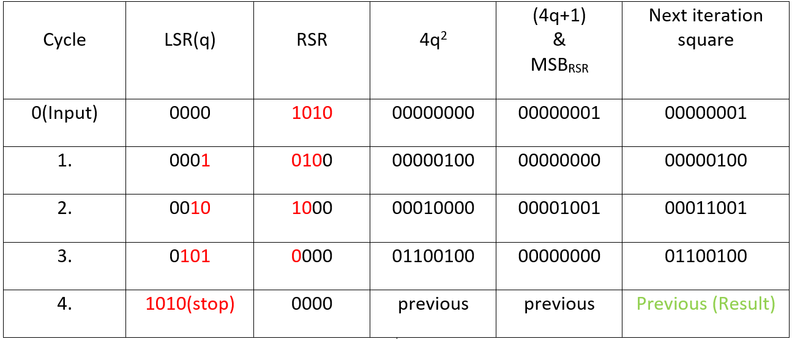

# Consilium Problem statement 2 Solution

Consilium is a digital electronics based event in Prastuti, The Anual Fest of Department of Electrical Engineering, IIT(BHU), Varansi.

There are two rounds for this competition and the problem statement for second one this year was to find square of a 4-bit number without using direct multiplication. Complete PS can be found [here](/Prastuti-Consilium_2022_PS2.pdf).

## Our approach
Let's say we have a N-bit number p of which we want to find square of. Naturally it can be either odd or even and therefore can be represented in two forms

<i>q is some other natural number</i>

Now, we can simply square each case after which we get <i>p 2</i> in terms of <i>q 2</i> and q. Then we can calculate square for q by employing the same method. Multiplication with 4 is fairly simple as it requires only two leftshifts of the number to multiplty with. This process can be repeated to get either 0 or 1 as the last remainder. Since this is basically floored division by 2, we have effectively reduced one bit from the number we have to calculate square for. We can also conclude that the number of times this has to be done will be **<i>log2 p</i>**.

For example : 

<i> numbers highlited as red are floored divisons for next iteration</i>

Now, one thing in general that can be said about floored division of a N-bit binary k number by some power M of 2 will result in a number whose binary representation will be exact as the first N-M MSBs of k.

Therefore, instead of calculating recursively, we can start from 1 and calculate the result upwards i.e. we first calculate the square of the number needed to calculate the square of the next number and so on.

like this :-

Hence we calculated the square of a 4-bit number in 4 cycles (<i>log2 p</i> complexity).

## Implementation

Here we have implemented the Calculator for 4-bit numbers, however it is expanadable to any number of bits.

To make this system we need following registers-
- one to store the input number
- one to store quotient of floored division by 2
- one to store <i>4q2</i> component, one to store <i>4q+1</i> component for the square of next iteration.
- and one to store square of next number calculated in previous step.

Floored division at each step can be calculated by shift-lefts from input register(say Right shift register or RSR) to other register(say left shift register or LSR). **Note that both registers will shift only left**. This way first quotient of ith floored division(i.e. with 2n-i, for n-bit input) can be calculated by i leftshifts.

Now, for the square (say p) for (i+1)th iteration, components <i>4q2</i> and <i>4q+1</i> need to be calculated in ith iteration. here q will be the values stored in LSR along with MSB of RSR. These will be added to give exact sq for nxt iteration and will be stored in the last register.

This process is repeated till we get the whole input in LSR, which will be after exact n cycles for n-bit number.

Consider following implementation for eg-
 

A Control FSM or Finite state machine has been designed to take the input, execute the algorithm for fixed N cycles (Here, we took N = 4) and afterwards enable the output to get the final result.

The Hardware implementation of the circuit has been done in Proteus and is uploaded in the repo.